# ESIEE-IT - 2022 - Pilotage de performance <a name="top"></a>

Ce projet a été testé sur une machine virtuel **Ubuntu 22.04** sous **VirtualBox**.

Le but de celui-ci est de **déployer**, **monitorer** et **tester** plusieurs applications sur un serveur.

L'application de démonstration utilisé est JPetStore, disponible ici : [github - mybatis-spring-boot-jpetstore](https://github.com/kazuki43zoo/mybatis-spring-boot-jpetstore).

**NB** : Il est possible de réaliser le projet rapidement de A à Z depuis un Ubuntu vierge.
Les commandes peuvent être direcetement `COPIER` et `COLLER` dans la console Ubuntu.

Ce projet projet a été testé sur 2 machines différentes composé :

- PC 1 : i7 6800K et 32Go RAM ▶ VT-x/AMD-V et Hyper-V ✅
- PC 2 : i7 8600 et 8Go RAM ▶ VT-x/AMD-V et Hyper-V ✅

Voici un schéma de l'infrastructure à construire :

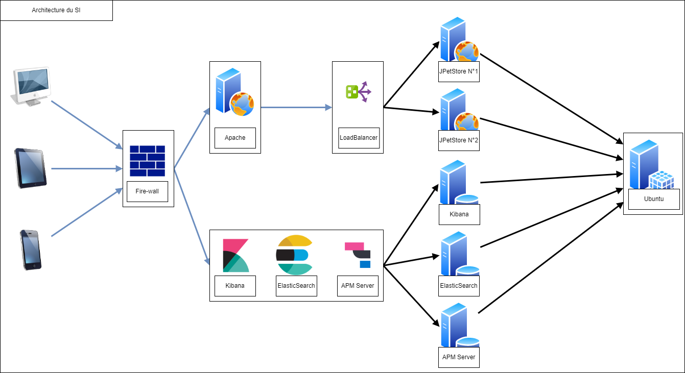

> **NB** : Seul le firewall n'est pas mis en place.

## Sommaire

- [1 - Pré-requis](#1)
  - [1.1 - Environnement utilisé](#1-1)
  - [1.2 - Configuration réseau de VM sur VirtualBox](#1-2)
- [2 - Préparation de système d'information](#2)
  - [2.1 - Mise à jour et installation des essentiels](#2-1)
  - [2.2 - Création des dossiers nécessaires et des fichiers de logs](#2-2)
  - [2.3 - Téléchargement des applications nécessaires](#2-3)
  - [2.4 - Configuration des applications JPetStore](#2-4)
  - [2.5 - Configuration du JAVA_HOME et complication des applications JPetStore](#2-5)
  - [2.6 - Activation et configuration de Apache avec les extensions de proxy](#2-6)
  - [2.7 - Configuration de Elasticsearch](#2-7)
  - [2.8 - Configuration de Kibana](#2-8)
  - [2.9 - Configuration de APM Serveur](#2-9)
  - [2.10 - Configuration de **systctl.conf**](#2-10)
  - [2.11 - Test des applications](#2-11)
  - [🚀 - 2.12 - Démarrage complet du système d'informations](#2-12)
  - [2.13 - Accès au applications](#2-13)
- [3 - Tests de perfomance](#3)
  - [3.1 - Installation de SProxy](#3-1)
  - [3.2 - Test de SProxy](#3-2)
  - [3.3 - Prépararer SProxy pour Siège](#3-3)
  - [🚀 - 3.4 - Tests de charge avec Siège](#3-4)
- [4 - Bonus Ubuntu 😉](4)
  - [4.1 - La commande `top` et `htop`](4-1)
  - [4.2 -Tuer un processus ](4-2)
  - [4.3 - Lecture des logs des applications JPetStore ou autre en temps réel ](4-3)
  - [4.5 - Lecture des logs de apache ](4-5)

## 1 - Pré-requis - [Haut de page](#top) <a name="1"></a>

### 1.1 - Environnement utilisé - [Haut de page](#top) <a name="1-1"></a>

L'ensemble de ces appliations étant groumand en fonctionnement, je recommande au minimum :

- 4 cores
- 4096 Mo de RAM

> **ATTENTION :** La VM peut s'avérer être très gourmande si celle-ci est mal optimisé ou si la configuration de l'hôte de VirtualBox est trop faible ou trop ancienne.

Voici un exemple de configuration recommandé sur VirtualBox avec les options à activer :

> **Cocher/Activer** les fonctions avancées :
> - **IO-APIC**
> - **EFI**
> - **Horloge interne en UTC**
> 
> 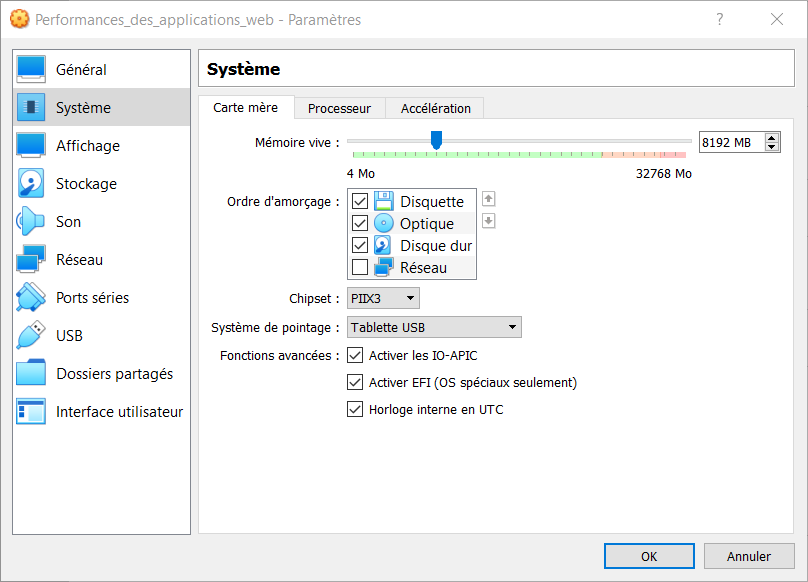

> **Cocher/Activer** les fonctions avancées :
> - **PEA/NX**
> - **VT-x/AMD-V** - (si indisponible, vérifier que le CPU de votre PC hôte prend bien en charge cette fonctionnalité)
> 
> 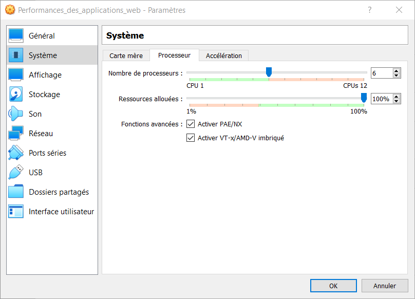

> **Cocher/Activer** les fonctions avancées :
> - **Hyper-V** si Windows / **KVM** si MacOS ou Linux
> - **pagination imbriqué**
> 
> 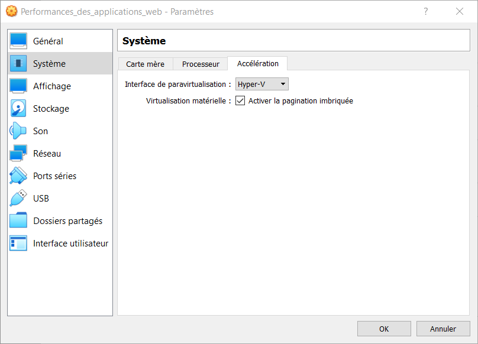

> **Cocher/Activer** les fonctions avancées :
> - **VMSVGA**
> - **Accélaration 3D**
> 
> 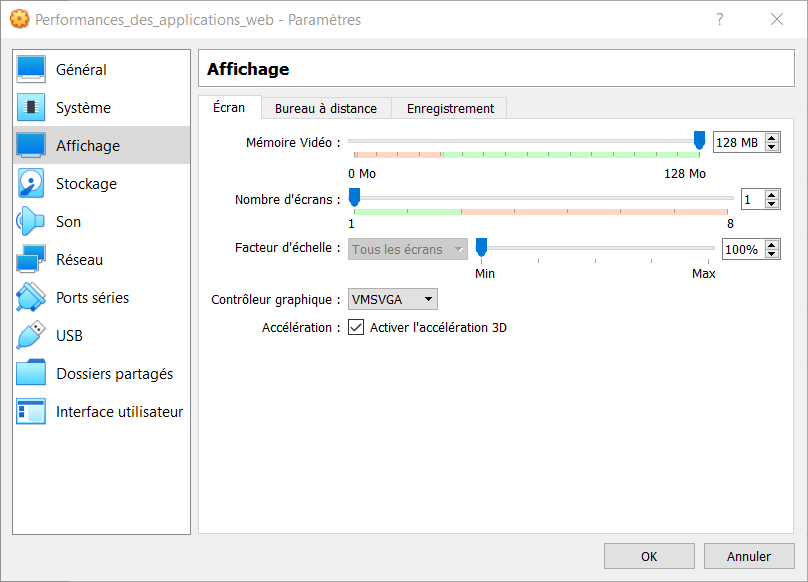


> **Optimisation interne à la VM VirtualBox** : Il important de toujours installer dans la VM les **drivers** de VirtualBox via le **CD d'addition invité...**.
> 
> 

### 1.2 - Configuration réseau de VM sur VirtualBox - [Haut de page](#top) <a name="1-2"></a>

Le but de ce projet est de préparer un environnement de type serveur avec un **LoadBalancer** et un système de monitoring accessible sur notre réseau. Il est donc nécessaire de configurer le réseau de la VM sur le mode **accès par pont**.

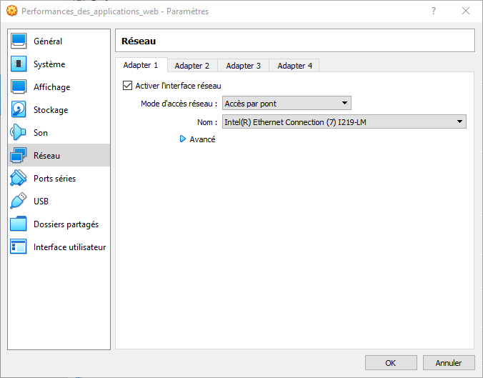

Sélectionné le nom de la carte réseau principal de la machine utilisant VirtualBox (ou VMWare ... ou ce que tu veux 😉 )

> Par défaut, VirtalBox sélectionne la carte réseau utilisé par le PC Hôte de VirtualBox, celle qui fournit internet en accès irecte. 

## 2 - Préparation de système d'information - [Haut de page](#top) <a name="2"></a>

### 2.1 - Mise à jour et installation des essentiels - [Haut de page](#top) <a name="2-1"></a>

- Git
- Tree
- HTop
- Net-Tools
- JDK 11
- Apache
- Siege (et ses dépendances)

```
sudo apt update && apt upgrade
sudo apt install git tree htop net-tools openjdk-11-jre-headless apache2 siege build-essential libnet-ssleay-perl liburi-perl libwww-perl
```

### 2.2 - Création des dossiers nécessaires et des fichiers de logs - [Haut de page](#top) <a name="2-2"></a>

Création des dossiers nécessaires :

```
mkdir JPetStore_Infra
mkdir JPetStore_Infra/apps
mkdir JPetStore_Infra/apps/sproxy
mkdir JPetStore_Infra/agents
mkdir JPetStore_Infra/logs
mkdir JPetStore_Infra/monitors
mkdir JPetStore_Infra/proxy
```

Création des fichiers de logs :

```
touch JPetStore_Infra/logs/jpetstore_1.logs
touch JPetStore_Infra/logs/jpetstore_2.logs
touch JPetStore_Infra/logs/elasticsearch.logs
touch JPetStore_Infra/logs/kibana.logs
touch JPetStore_Infra/logs/apm_server.logs
```

### 2.3 - Téléchargement des applications nécessaires - [Haut de page](#top) <a name="2-3"></a>

Téléchargement des applications nécessaires :

- App Java - **JPetStore**
- App Java - **APM Agent**
- Monitor - **Elasticsearch**
- Monitor - **Kibana**
- Monitor - **APM Server**
- Outil de test de performance - **SProxy**

```
cd JPetStore_Infra/apps
git clone https://github.com/kazuki43zoo/mybatis-spring-boot-jpetstore.git
wget https://search.maven.org/remotecontent?filepath=co/elastic/apm/elastic-apm-agent/1.29.0/elastic-apm-agent-1.29.0.jar
mv 'remotecontent?filepath=co%2Felastic%2Fapm%2Felastic-apm-agent%2F1.29.0%2Felastic-apm-agent-1.29.0.jar' elastic-apm-agent-1.29.0.jar
wget https://artifacts.elastic.co/downloads/elasticsearch/elasticsearch-7.16.3-linux-x86_64.tar.gz
wget https://artifacts.elastic.co/downloads/kibana/kibana-7.16.3-linux-x86_64.tar.gz
wget https://artifacts.elastic.co/downloads/apm-server/apm-server-7.16.3-linux-x86_64.tar.gz
wget https://download.joedog.org/sproxy/sproxy-latest.tar.gz
```

Décompression des applications nécessaires :

```
tar -xzvf elasticsearch-7.16.3-linux-x86_64.tar.gz
tar -xzvf kibana-7.16.3-linux-x86_64.tar.gz
tar -xzvf apm-server-7.16.3-linux-x86_64.tar.gz
tar -zxf sproxy-latest.tar.gz
```

Nettoyage des téléchargements :

```
sudo rm -r apm-server-7.16.3-linux-x86_64.tar.gz
sudo rm -r kibana-7.16.3-linux-x86_64.tar.gz
sudo rm -r elasticsearch-7.16.3-linux-x86_64.tar.gz
sudo rm -r sproxy-latest.tar.gz
sudo rm -r Dl/mybatis-spring-boot-jpetstore
```

Duplication de l'application JPetStore :

```
cd
cp -r Dl/mybatis-spring-boot-jpetstore/ JPetStore_Infra/apps/jpetstore_1
cp -r Dl/mybatis-spring-boot-jpetstore/ JPetStore_Infra/apps/jpetstore_2
```

On a donc les dossiers :

```
ls JPetStore_Infra/apps
ls JPetStore_Infra/agents
ls JPetStore_Infra/logs
ls JPetStore_Infra/monitors
ls JPetStore_Infra/proxy
```

Ils contiennent :

```
apps      ==>    jpetstore_1  jpetstore_2
agents    ==>    elastic-apm-agent-1.29.0.jar
logs      ==>    jpetstore_1.logs  jpetstore_2.logs
monitors  ==>    apm-server-7.16.3-linux-x86_64  elasticsearch-7.16.3  kibana-7.16.3-linux-x86_64
proxy     ==>    sproxy-1.02
```

Déplacement des applications dans les dossiers respectifs :

```
mv Dl/apm-server-7.16.3-linux-x86_64/ JPetStore_Infra/monitors/apm-server-7.16.3-linux-x86_64/
mv Dl/elasticsearch-7.16.3/ JPetStore_Infra/monitors/elasticsearch-7.16.3/
mv Dl/kibana-7.16.3-linux-x86_64/ JPetStore_Infra/monitors/kibana-7.16.3-linux-x86_64/
mv Dl/elastic-apm-agent-1.29.0.jar JPetStore_Infra/agents/elastic-apm-agent-1.29.0.jar
mv Dl/sproxy-1.02/ JPetStore_Infra/proxy/sproxy-1.02/
```

### 2.4 - Configuration des applications JPetStore - [Haut de page](#top) <a name="2-4"></a>

```
nano JPetStore_Infra/apps/jpetstore_1/src/main/resources/application.properties
nano JPetStore_Infra/apps/jpetstore_2/src/main/resources/application.properties
```

Il faut ajouté un port à l'application **JPetStore N°1** et **JPetStore N°2** ainsi que désactiver la configuration **datasource**.
Pour cela, il faut faire :

- **Port** :
  - Dans la confiiguration **JPetStore N°1** : ajouté `server.port=8081`
  - Dans la confiiguration **JPetStore N°2** : ajouté `server.port=8082`
- **Datasource** : 
  - Dans la confiiguration **JPetStore N°1** : ajouté `;hsqldb.lock_file=false` à la configuration `spring.datasource` afin d'obtenir :
▶ `spring.datasource.url=jdbc:hsqldb:file:~/db/jpetstore;hsqldb.lock_file=false`

> Résultat de la configuration de **JPetStore N°1** :
> 
> 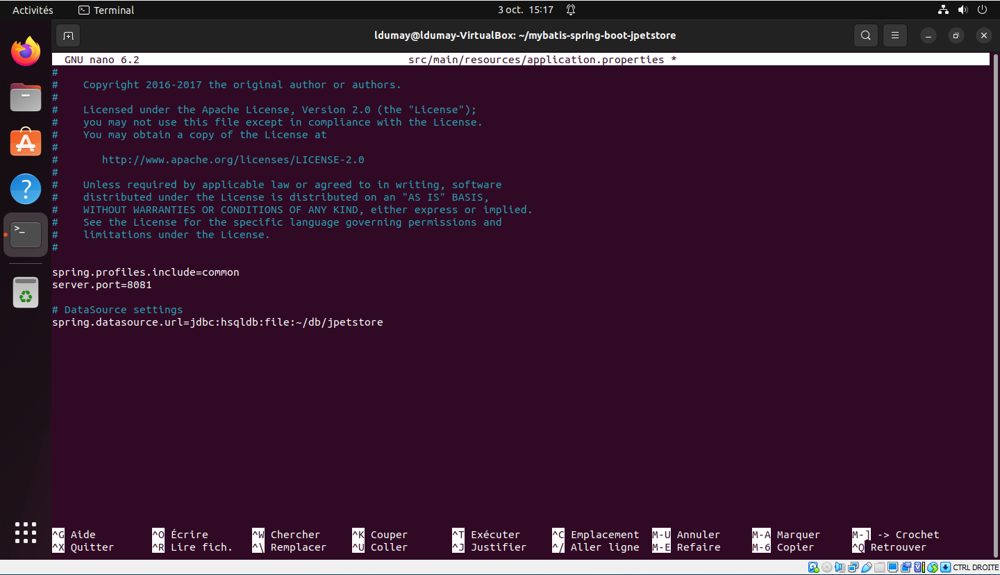
> 
> Faites pareil avec **JPetStore N°2**

### 2.5 - Configuration du JAVA_HOME et complication des applications JPetStore - [Haut de page](#top) <a name="2-5"></a>

Configuration du JAVA_HOME :

```
export JAVA_HOME=/usr/lib/jvm/java-11-openjdk-amd64
```

> Vérifier la bonne configuration :
>
> ```
> echo $JAVA_HOME
> ```
>
> *Résultat*
>
> ```
> /usr/lib/jvm/java-11-openjdk-amd64
> ```

Complication des applications **JPetStore N°1** et **JPetStore N°2**  :

- JPetStore 1 :

```
cd
cd JPetStore_Infra/apps/jpetstore_1/
./mvnw clean package -DskipTests=true
```

- JPetStore 2 :

```
cd
cd JPetStore_Infra/apps/jpetstore_2/
./mvnw clean package -DskipTests=true
```

> Attendre la fin de la compilation de chaque :
> 
> ```
> [INFO] Replacing main artifact with repackaged archive
> [INFO] ------------------------------------------------------------------------
> [INFO] BUILD SUCCESS
> [INFO] ------------------------------------------------------------------------
> [INFO] Total time:  11:54 min
> [INFO] Finished at: 2022-10-07T23:22:51+02:00
> [INFO] ------------------------------------------------------------------------
> ```

Vérification des compilation des applications **JPetStore N°1** et **JPetStore N°2** 

JPetStore 1 et 2 :

```
cd
ls JPetStore_Infra/apps/jpetstore_1/target/
cd
ls JPetStore_Infra/apps/jpetstore_2/target/
```

Résultat de chaque dossier : 

```
classes                 maven-status
generated-sources       mybatis-spring-boot-jpetstore-2.0.0-SNAPSHOT.jar
generated-test-sources  mybatis-spring-boot-jpetstore-2.0.0-SNAPSHOT.jar.original
maven-archiver          test-classes
```

> Si le **jar** `mybatis-spring-boot-jpetstore-2.0.0-SNAPSHOT.jar` existe, la compilation s'est bien passée.

### 2.6 - Activation et configuration de Apache avec les extensions de proxy - [Haut de page](#top) <a name="2-6"></a>

Activation de Apache :

```
sudo systemctl enable apache2
sudo systemctl start apache2.service
sudo systemctl status apache2.service
```

Résultat :

```
ynchronizing state of apache2.service with SysV service script with /lib/systemd/systemd-sysv-install.
Executing: /lib/systemd/systemd-sysv-install enable apache2
● apache2.service - The Apache HTTP Server
     Loaded: loaded (/lib/systemd/system/apache2.service; enabled; vendor preset: enabled)
     Active: active (running) since Sat 2022-10-08 09:11:34 CEST; 5min ago
       Docs: https://httpd.apache.org/docs/2.4/
   Main PID: 752 (apache2)
      Tasks: 55 (limit: 7022)
     Memory: 8.5M
        CPU: 390ms
     CGroup: /system.slice/apache2.service
             ├─752 /usr/sbin/apache2 -k start
             ├─753 /usr/sbin/apache2 -k start
             └─754 /usr/sbin/apache2 -k start
oct. 08 09:11:33 ldumay-VirtualBox systemd[1]: Starting The Apache HTTP Server...
oct. 08 09:11:34 ldumay-VirtualBox apachectl[722]: AH00558: apache2: Could not reliably determine the server'>
oct. 08 09:11:34 ldumay-VirtualBox systemd[1]: Started The Apache HTTP Server.
```

Activer les extensions de proxy :

```
sudo a2enmod proxy proxy_http proxy_balancer headers lbmethod_byrequests
sudo systemctl restart apache2
```

On récupère l'ip de la machine :

```
ifconfig
```

On crée et édite un fichier de configuration de vhost pour les application jpetstore que l'on appellera jpetstore.conf.

```
sudo nano /etc/apache2/sites-available/jpetstore.conf
```

Ci-dessous, le contenu du ficher jpetstore.conf.

```
<VirtualHost *:80>
    Header add Set-Cookie "ROUTEID=.%{BALANCER_WORKER_ROUTE}e; path=/" env=BALANCER_ROUTE_CHANGED
    ProxyRequests Off
    ProxyPreserveHost On

    <Proxy "balancer://mycluster">
        BalancerMember "http://192.168.1.252:8081" route=1
                #attention: il faut changer les IPs et vérifier les ports
        BalancerMember "http://192.168.1.252:8082" route=2
        ProxySet stickysession=ROUTEID
    </Proxy>

    ProxyPass "/" "balancer://mycluster/"
    ProxyPassReverse "/" "balancer://mycluster/"

    ErrorLog ${APACHE_LOG_DIR}/error.log
	CustomLog ${APACHE_LOG_DIR}/access.log combined
</VirtualHost>
```

Vérifier la bonne écriture et le contenu du fichier avec :

```
cat /etc/apache2/sites-available/jpetstore.conf
```

Désactiver le site par défaut d'apache.

```
sudo nano /etc/apache2/apache2.conf
```

> Avant :
> 
> 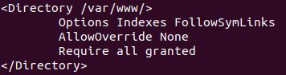

> Après
> 
> 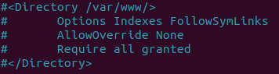

Désactiver la configuration par défaut de apache :

```
sudo a2dissite
Your choices are: 000-default
Which site(s) do you want to disable (wildcards ok)?
000-default
Site 000-default disabled.
To activate the new configuration, you need to run:
  systemctl reload apache2
```
> ▶ `000-default`

Activer la configuration `jpetstore.conf`. 

```
sudo a2ensite
Your choices are: 000-default default-ssl jpetstore
Which site(s) do you want to enable (wildcards ok)?
jpetstore
Enabling site jpetstore.
To activate the new configuration, you need to run:
  systemctl reload apache2
```

> ▶ `jpetstore`

Redémarrer apache.

```
systemctl reload apache2
```

### 2.7 - Configuration de Elasticsearch - [Haut de page](#top) <a name="2-7"></a>

```
sudo nano JPetStore_Infra/monitors/elasticsearch-7.16.3/config/elasticsearch.yml
```

Résultat

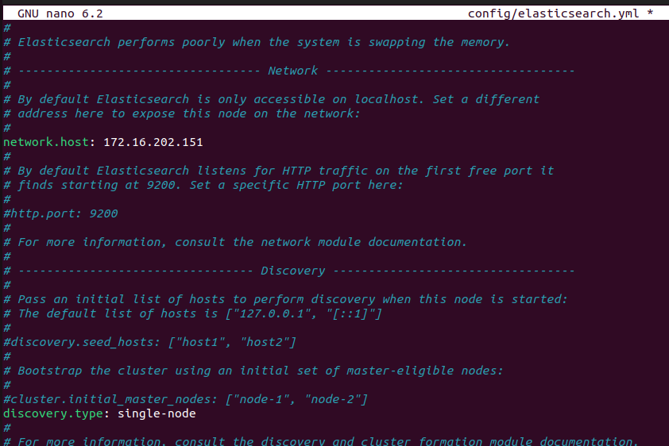

> Configurer avec :
> - `network.host: 192.168.1.252`
> - `discovery.type: single-node`

### 2.8 - Configuration de Kibana - [Haut de page](#top) <a name="2-8"></a>

```
sudo nano JPetStore_Infra/monitors/kibana-7.16.3-linux-x86_64/config/kibana.yml
```

Résultat

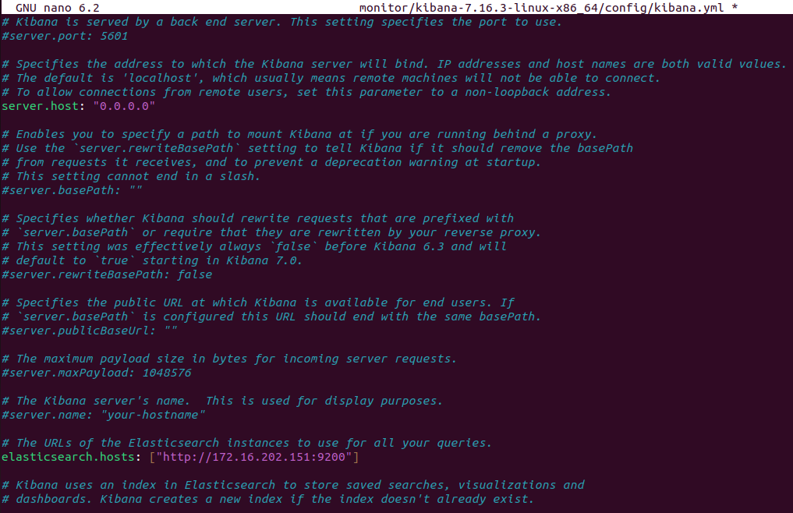

> Configurer avec :
> - `server.host: 0.0.0.0`
> - `elasticsearch.hosts: http://192.168.1.252:9200/`

### 2.9 - Configuration de APM Serveur - [Haut de page](#top) <a name="2-9"></a>

```
sudo nano JPetStore_Infra/monitors/apm-server-7.16.3-linux-x86_64/apm-server.yml
```

Résultat

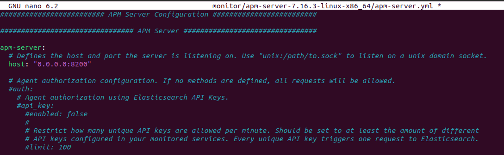

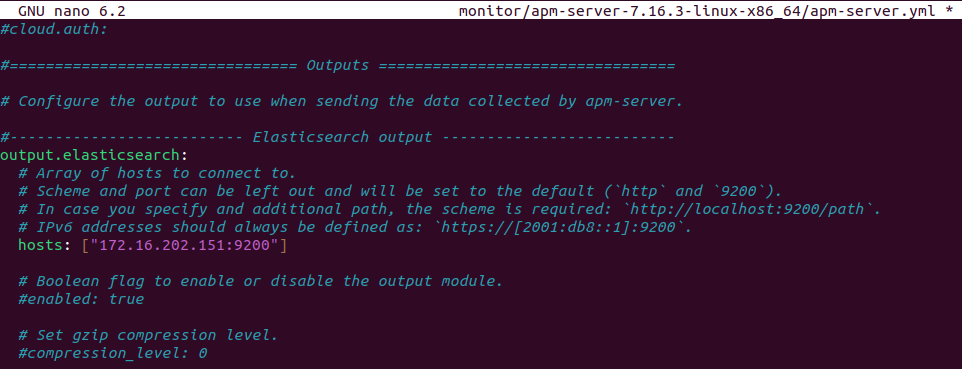

> Configurer avec :
> - `host: 0.0.0.0:8200`
> - `hosts: 192.168.1.252:9200`

### 2.10 - Configuration de **systctl.conf** - [Haut de page](#top) <a name="2-10"></a>

Ajouter `vm.max_map_count=262144` au fichier `sysctl.conf` :

```
sudo nano /etc/sysctl.conf
```

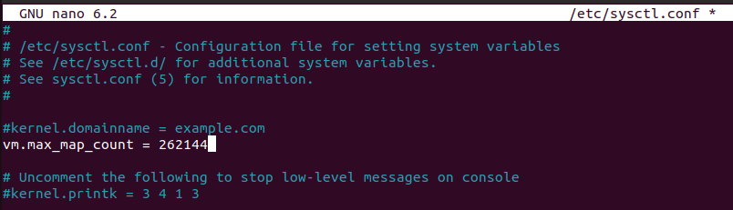

Valider le :

```
sudo sysctl -w vm.max_map_count=262144
```

Recharghement de la configuration :

```
sudo sysctl -p
```

### 2.11 - Test des applications - [Haut de page](#top) <a name="2-11"></a>

Test des applications :

**JPetStore N°1**

```
java -jar JPetStore_Infra/apps/jpetstore_1/target/mybatis-spring-boot-jpetstore-2.0.0-SNAPSHOT.jar
```

**JPetStore N°2**

```
java -jar JPetStore_Infra/apps/jpetstore_2/target/mybatis-spring-boot-jpetstore-2.0.0-SNAPSHOT.jar
```

**Elasticsearch**

```
./JPetStore_Infra/monitors/elasticsearch-7.16.3/bin/elasticsearch
```

> - Peut être un peut long à démarrer.

**Kibana**

```
./JPetStore_Infra/monitors/kibana-7.16.3-linux-x86_64/bin/kibana
```

> - Dépends de Elastic search
> - Peut être un peut long à démarrer.

**APM Serveur**

```
cd JPetStore_Infra/monitors/apm-server-7.16.3-linux-x86_64/
./apm-server -e
```

> **Voici un exmple de démarrage** :
> 
> 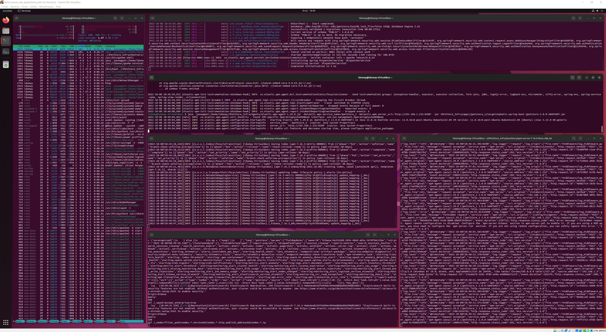

### 2.12 - Démarrage complet du système d'informations - [Haut de page](#top) <a name="2-12"></a>

Démarrage des applications **JPetStore N°1** et **JPetStore N°2** :

```
nohup java -javaagent:/home/ldumay/JPetStore_Infra/agents/elastic-apm-agent-1.29.0.jar -Delastic.apm.service_name=JpetStore_1 -Delastic.apm.server_url='http://192.168.1.252:8200' -jar JPetStore_Infra/apps/jpetstore_1/target/mybatis-spring-boot-jpetstore-2.0.0-SNAPSHOT.jar > JPetStore_Infra/logs/jpetstore_1.logs &
nohup java -javaagent:/home/ldumay/JPetStore_Infra/agents/elastic-apm-agent-1.29.0.jar -Delastic.apm.service_name=JpetStore_2 -Delastic.apm.server_url='http://192.168.1.252:8200' -jar JPetStore_Infra/apps/jpetstore_1/target/mybatis-spring-boot-jpetstore-2.0.0-SNAPSHOT.jar > JPetStore_Infra/logs/jpetstore_2.logs &
```

Démarrage des applications **Elasticsearch**, puis de **Kibana** :

```
./JPetStore_Infra/monitors/elasticsearch-7.16.3/bin/elasticsearch > JPetStore_Infra/logs/elasticsearch.logs &
./JPetStore_Infra/monitors/kibana-7.16.3-linux-x86_64/bin/kibana > JPetStore_Infra/logs/kibana.logs &
```

Démarrage de l'application **APM Serveur** :

```
cd JPetStore_Infra/monitors/apm-server-7.16.3-linux-x86_64/
./apm-server -e
```

> Etant un peu capricieuse, il est recommandé de démarrer l'application dans son dossier propre et de laisser le terminal ouvert.
> 
> L'idéal serait de démarrer l'application de manière indépendante mais cela ne fonctionne pas pour le moment avec la requète ci-dessous.
> 
> ```
> ./JPetStore_Infra/monitors/apm-server-7.16.3-linux-x86_64/apm-server -e > JPetStore_Infra/logs/apm_server.logs &
> ```

Résultat :

```
[1] 2746
[2] 2747
[3] 2835
[4] 3074
[5] 3075
```

### 2.13 - Accès au applications - [Haut de page](#top) <a name="2-13"></a>

- JPetStore *(par LoadBalancer)* : [http://192.168.1.252/](http://192.168.1.252/) - *Affiche la page web de l'application JPetStore choisi par le LoadBalancer de Apache et **disponible***.
  - JPetStore *(par port direct 8081)* : [http://192.168.1.252:8081/](http://192.168.1.252:8081/) - *Affiche la page web de l'application JPetStore sur le port 8081*.
  - JPetStore *(par port direct 8082)* : [http://192.168.1.252:8082/](http://192.168.1.252:8082/) - *Affiche la page web de l'application JPetStore sur le port 8082*.
- Elasticsearch : [http://192.168.1.252:9200/](http://192.168.1.252:9200/) - *Affiche la page web API de l'application Elasticsearch sur le port 9200*.
- APM Serveur : [http://192.168.1.252:8200/](http://192.168.1.252:8200/) - *Affiche la page web API de l'application APM Serveur sur le port 8200*.
- Kibana : [http://192.168.1.252:5601/](http://192.168.1.252:5601/) - *Affiche la page web de l'application Kibana sur le port 5601*.

#### Résultat de JPetStore

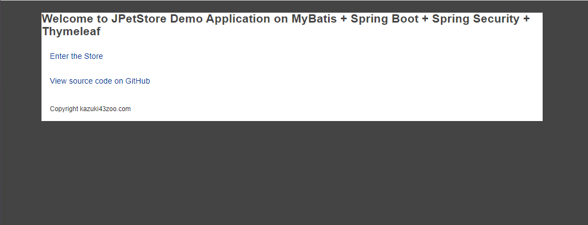

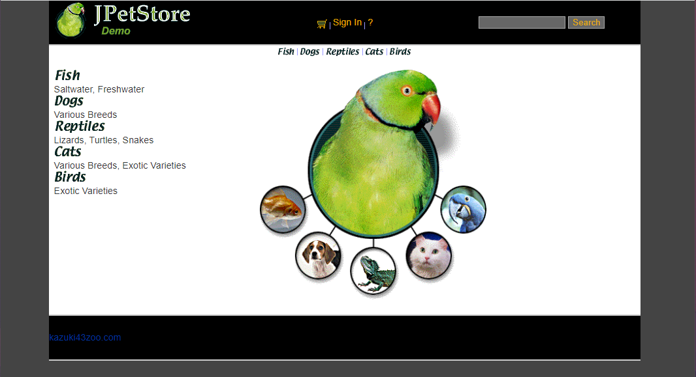

#### Résultat de Elasticsearch

```
{
  "name" : "ldumay-vm",
  "cluster_name" : "elasticsearch",
  "cluster_uuid" : "glBwYJqCTJC-aTZxfP8GJw",
  "version" : {
    "number" : "7.16.3",
    "build_flavor" : "default",
    "build_type" : "tar",
    "build_hash" : "4e6e4eab2297e949ec994e688dad46290d018022",
    "build_date" : "2022-01-06T23:43:02.825887787Z",
    "build_snapshot" : false,
    "lucene_version" : "8.10.1",
    "minimum_wire_compatibility_version" : "6.8.0",
    "minimum_index_compatibility_version" : "6.0.0-beta1"
  },
  "tagline" : "You Know, for Search"
}
```

#### Résultat de APM Serveur

```
{
  "build_date": "2022-01-06T23:27:35Z",
  "build_sha": "fde0af4fa2b9f39e518b333c5be56cf8be215ca0",
  "publish_ready": true,
  "version": "7.16.3"
}
```

#### Résultat de Kibana


> Capture de Kibana


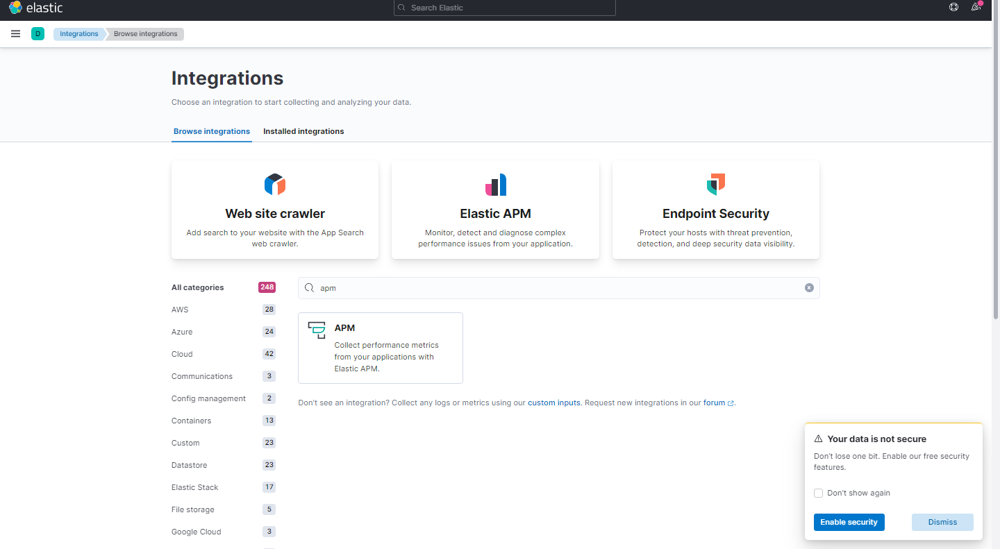

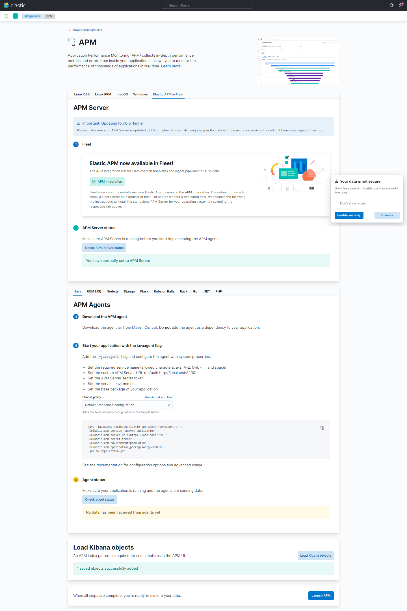

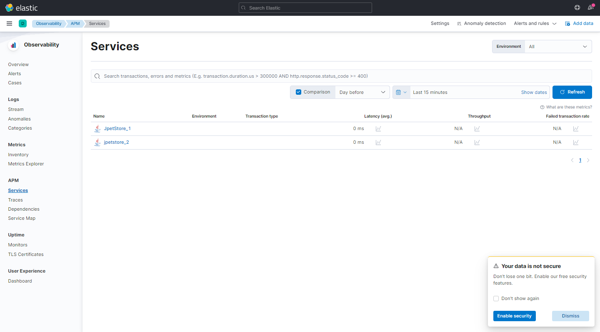

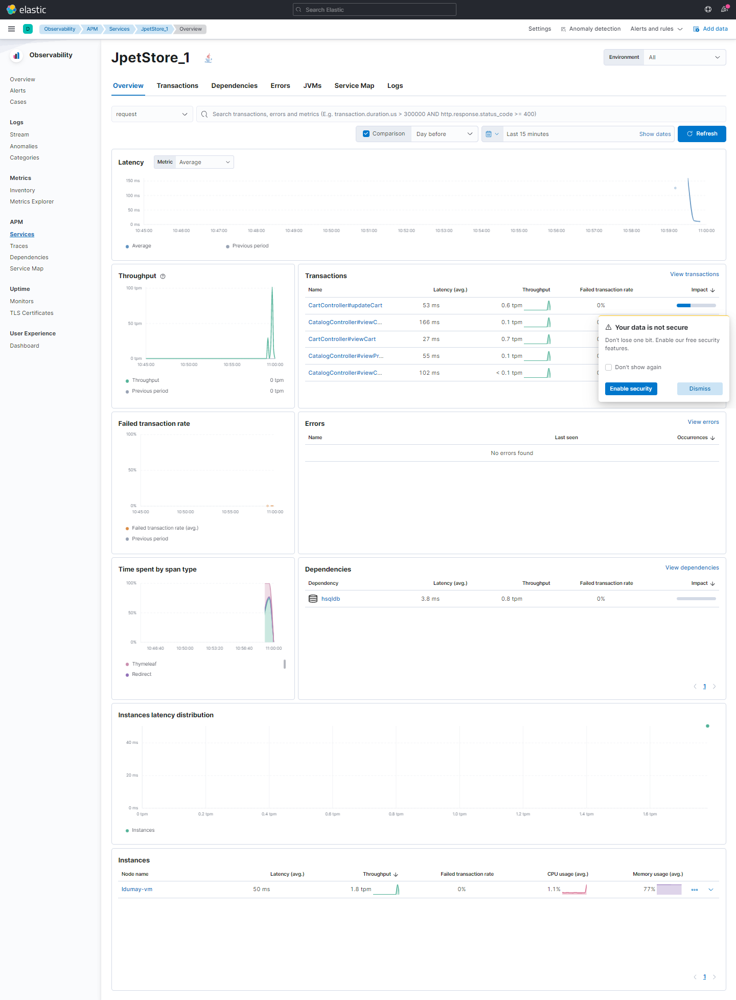

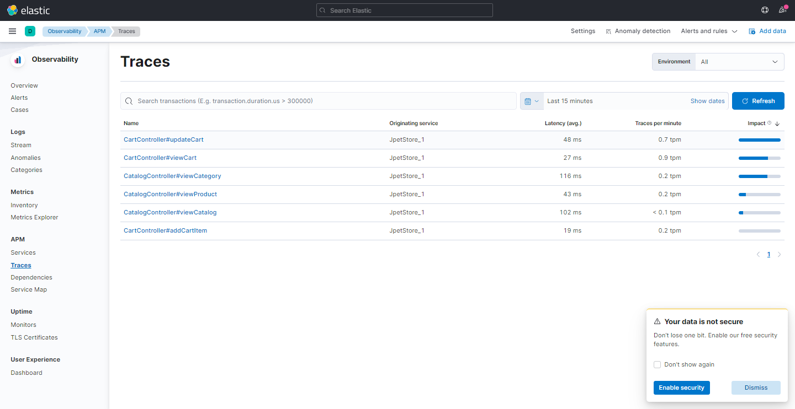

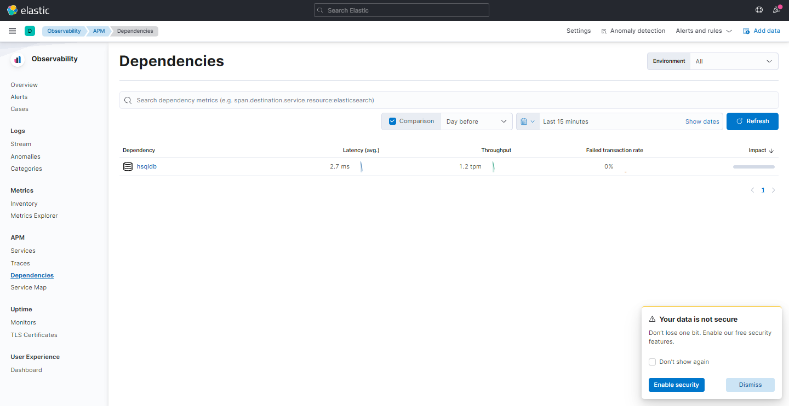

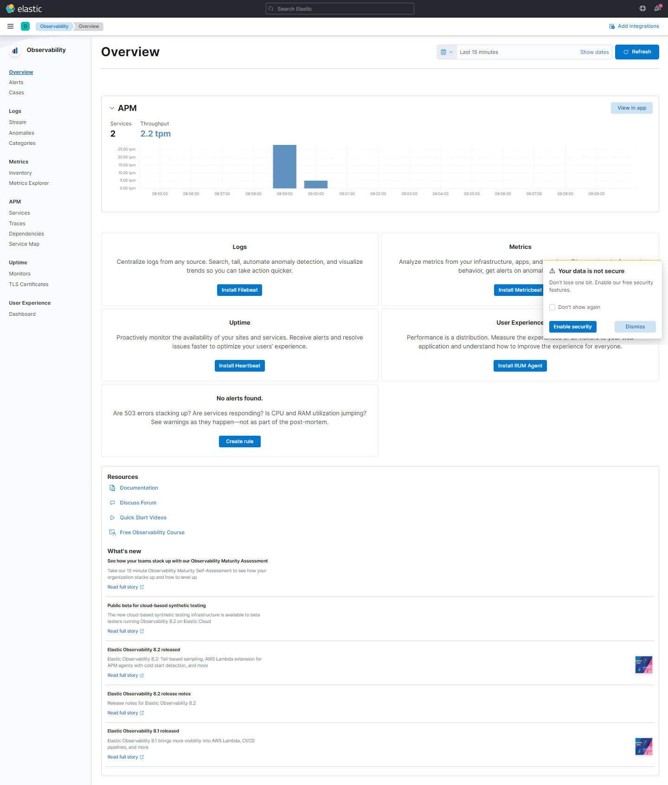

## 3 - Tests de perfomance - [Haut de page](#top) <a name="3"></a>

### 3.1 - Installation de SProxy [Haut de page](#top) <a name="3-1"></a>

```
cd JPetStore_Infra/proxy/sproxy-1.02/
./configure
sudo make
sudo make install
```

### 3.2 - Test de SProxy [Haut de page](#top) <a name="3-2"></a>

Lancer un termnial SProxy :

```
cd ~
sproxy -v
```

Résultats :

```
ldumay@ldumay-vm:~$ cd ~
ldumay@ldumay-vm:~$ sproxy -v
SPROXY v1.02 listening on port 9001
...appending HTTP requests to: /home/ldumay/urls.txt
...default connection timeout: 120 seconds
```

SProxy fonctionne bien, on peux arréter SProxy avec `CTRL` + `C`.

> Un fichier `urls.txt ` est créé et il est vérifiable avec `cat urls.txt`. Normalement il est vide.

### 3.3 - Prépararer SProxy pour Siège [Haut de page](#top) <a name="3-3"></a>

Lancer un SProxy et laisser ce termninal ouvert :

```
sproxy -o ./urls.txt
```

Dans un autre terminal, lancer une lecture du service cible, ici **JPetStore**  `192.168.1.252`.

```
wget -r -o verbose.txt -l 0 -t 1 --spider -w 1 -e robots=on -e "http_proxy=http://127.0.0.1:9001" "http://192.168.1.252:80/"
```

Puis **Attendre ...** 😉

Une fois que cette commande `wget` sare terminé, fermer ce terminal. Puis retourner sur le terminal SProxy précédemment ouvert pour le fermer avec `CTRL` + `C`.

Ensuite, il faut nettoyer le fichier produit `urls.txt`

```
sort -u -o urls.txt urls.txt
```

Il est maintenant possible de vérifier le fichier `urls.txt `, il devrais stocker toutes les traces urls effectuées sur le site **JPetStore**.

> Exemple
> 
> ```
> cat urls.txt 
> http://192.168.1.2/
> http://192.168.1.2/accounts/create?form
> http://192.168.1.2/cart
> http://192.168.1.2/cart?add&itemId=EST-1
> http://192.168.1.2/cart?add&itemId=EST-10
> http://192.168.1.2/cart?add&itemId=EST-11
> http://192.168.1.2/cart?add&itemId=EST-12
> http://192.168.1.2/cart?add&itemId=EST-13
> http://192.168.1.2/cart?add&itemId=EST-14
> http://192.168.1.2/cart?add&itemId=EST-15
> http://192.168.1.2/cart?add&itemId=EST-16
> http://192.168.1.2/cart?add&itemId=EST-17
> http://192.168.1.2/cart?add&itemId=EST-18
> http://192.168.1.2/cart?add&itemId=EST-19
> http://192.168.1.2/cart?add&itemId=EST-2
> http://192.168.1.2/cart?add&itemId=EST-20
> http://192.168.1.2/cart?add&itemId=EST-21
> http://192.168.1.2/cart?add&itemId=EST-22
> http://192.168.1.2/cart?add&itemId=EST-23
> http://192.168.1.2/cart?add&itemId=EST-24
> http://192.168.1.2/cart?add&itemId=EST-25
> http://192.168.1.2/cart?add&itemId=EST-26
> http://192.168.1.2/cart?add&itemId=EST-27
> http://192.168.1.2/cart?add&itemId=EST-28
> http://192.168.1.2/cart?add&itemId=EST-3
> http://192.168.1.2/cart?add&itemId=EST-4
> http://192.168.1.2/cart?add&itemId=EST-5
> http://192.168.1.2/cart?add&itemId=EST-6
> http://192.168.1.2/cart?add&itemId=EST-7
> http://192.168.1.2/cart?add&itemId=EST-8
> http://192.168.1.2/cart?add&itemId=EST-9
> http://192.168.1.2/catalog
> http://192.168.1.2/catalog/categories/BIRDS
> http://192.168.1.2/catalog/categories/CATS
> http://192.168.1.2/catalog/categories/DOGS
> http://192.168.1.2/catalog/categories/FISH
> http://192.168.1.2/catalog/categories/REPTILES
> http://192.168.1.2/catalog/items/EST-1
> http://192.168.1.2/catalog/items/EST-10
> http://192.168.1.2/catalog/items/EST-11
> http://192.168.1.2/catalog/items/EST-12
> http://192.168.1.2/catalog/items/EST-13
> http://192.168.1.2/catalog/items/EST-14
> http://192.168.1.2/catalog/items/EST-15
> http://192.168.1.2/catalog/items/EST-16
> http://192.168.1.2/catalog/items/EST-17
> http://192.168.1.2/catalog/items/EST-18
> http://192.168.1.2/catalog/items/EST-19
> http://192.168.1.2/catalog/items/EST-2
> http://192.168.1.2/catalog/items/EST-20
> http://192.168.1.2/catalog/items/EST-21
> http://192.168.1.2/catalog/items/EST-22
> http://192.168.1.2/catalog/items/EST-23
> http://192.168.1.2/catalog/items/EST-24
> http://192.168.1.2/catalog/items/EST-25
> http://192.168.1.2/catalog/items/EST-26
> http://192.168.1.2/catalog/items/EST-27
> http://192.168.1.2/catalog/items/EST-28
> http://192.168.1.2/catalog/items/EST-3
> http://192.168.1.2/catalog/items/EST-4
> http://192.168.1.2/catalog/items/EST-5
> http://192.168.1.2/catalog/items/EST-6
> http://192.168.1.2/catalog/items/EST-7
> http://192.168.1.2/catalog/items/EST-8
> http://192.168.1.2/catalog/items/EST-9
> http://192.168.1.2/catalog/products/AV-CB-01
> http://192.168.1.2/catalog/products/AV-SB-02
> http://192.168.1.2/catalog/products/FI-FW-01
> http://192.168.1.2/catalog/products/FI-FW-02
> http://192.168.1.2/catalog/products/FI-SW-01
> http://192.168.1.2/catalog/products/FI-SW-02
> http://192.168.1.2/catalog/products/FL-DLH-02
> http://192.168.1.2/catalog/products/FL-DSH-01
> http://192.168.1.2/catalog/products/K9-BD-01
> http://192.168.1.2/catalog/products/K9-CW-01
> http://192.168.1.2/catalog/products/K9-DL-01
> http://192.168.1.2/catalog/products/K9-PO-02
> http://192.168.1.2/catalog/products/K9-RT-01
> http://192.168.1.2/catalog/products/K9-RT-02
> http://192.168.1.2/catalog/products/RP-LI-02
> http://192.168.1.2/catalog/products/RP-SN-01
> http://192.168.1.2/css/jpetstore.css
> http://192.168.1.2/help.html
> http://192.168.1.2/images/birds_icon.gif
> http://192.168.1.2/images/cart.gif
> http://192.168.1.2/images/cats_icon.gif
> http://192.168.1.2/images/dogs_icon.gif
> http://192.168.1.2/images/fish_icon.gif
> http://192.168.1.2/images/logo-topbar.gif
> http://192.168.1.2/images/reptiles_icon.gif
> http://192.168.1.2/images/separator.gif
> http://192.168.1.2/images/sm_birds.gif
> http://192.168.1.2/images/sm_cats.gif
> http://192.168.1.2/images/sm_dogs.gif
> http://192.168.1.2/images/sm_fish.gif
> http://192.168.1.2/images/sm_reptiles.gif
> http://192.168.1.2/images/splash.gif
> http://192.168.1.2/login
> http://192.168.1.2/robots.txt
> ```

### 3.4 - Tests de charge avec Siège [Haut de page](#top) <a name="3-4"></a>

Pour tester simuler une charge sur **JPetStore** :

```
siege -v -c 20 -i -t 1M -f urls.txt
```

Siege va attaquer la liste des URL du site -c concurrence
● Avec 20 utilisateurs simultanés
● Pendant 1 minutes

Résultat

```
{	"transactions":			       10826,
	"availability":			      100.00,
	"elapsed_time":			       59.89,
	"data_transferred":		        9.25,
	"response_time":		        0.11,
	"transaction_rate":		      180.76,
	"throughput":			        0.15,
	"concurrency":			       19.81,
	"successful_transactions":	       10819,
	"failed_transactions":		           0,
	"longest_transaction":		        1.68,
	"shortest_transaction":		        0.00
}
```

Il est donc possible de simuler les tests que l'on souhaite :

> - Pour 200 utilisateurs pendant 5 minutes :
> 
> ```
> siege -v -c 200 -i -t 5M -f urls.txt
> ```
> 
> - Pour 400 utilisateurs pendant 10 minutes :
> 
> ```
> siege -v -c 400 -i -t 10M -f urls.txt
> ```


## 4 - Bonus Ubuntu 😉- [Haut de page](#top) <a name="4"></a>

### 4.1 - La commande `top` et `htop` - [Haut de page](#top) <a name="4-1"></a>

Pour vérifier les processus en cours sur Ubuntu, faite la commande `top`. Celle-ci ouvre un monteur d'acivité en console. Pour le fermer, faite `CTRL`+ `C`.

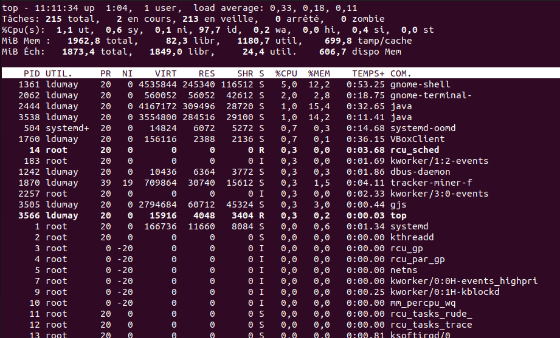

> Sur la capture, les 2 applications java d'ids **2444** et **3538** sont **JPetStore N°1** et **JPetStore N°2**.

Cela est aussi possible de manière plus détaillé avec la commande `htop` qui ouvrira lui aussi un monteur d'acivité en console avec de la coloration intégrée.

### 4.2 -Tuer un processus - [Haut de page](#top) <a name="4-2"></a>

Pour tuer un processus, la commande est `kill <id_processus>`.

Exemple :

```
kill 2320
kill 2321
kill 2322
kill 2323
```

### 4.3 - Lecture des logs des applications JPetStore ou autre en temps réel - [Haut de page](#top) <a name="4-3"></a>

Pour lire les logs de chaque application JPetStore en temps réel, faite `tail -f <path_fichier.extansion>`.

Exemple :

```
tail -f JPetStore_Infra/logs/jpetstore_1.logs

OU

tail -f JPetStore_Infra/logs/jpetstore_2.logs
```

Pour le fermer, faite `CTRL`+ `C`.

### 4.5 - Lecture des logs de apache - [Haut de page](#top) <a name="4-5"></a>

Pour lire les logs de apache.

```
cat /var/log/apache2/error.log
cat /var/log/apache2/access.log
```
