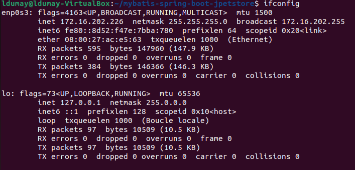

# ESIEE - 2022 - Pilotage de performance <a name="top"></a>

Ce projet a été testé sur une machine virtuel **Ubuntu 22.04** sous **VirtualBox**.

Le but de celui-ci est de **déployer**, **monitorer** et **tester** plusieurs applications sur un serveur.

L'application de démonstration utilisé est disponible ici : [github - mybatis-spring-boot-jpetstore](https://github.com/kazuki43zoo/mybatis-spring-boot-jpetstore).

## Sommaire

- [1 - Pré-requis](#1)
    - [1.1 - Mise à jour et outils utils](#1-1)
    - [1.2 - Net Tools](#1-2)
    - [1.3 - JDK 11](#1-3)
    - [1.4 - Configuration réseau](#1-4)
- [2 - TP - 1 - Installation d'une application Java JEE](#2)
    - [2.1 - Clone & Run](#2-1)
    - [2.2 - Accés via *localhost* et *`*ip*](#2-2)
- [3 - TP - 2 - Partie 1 - Configuration de 2 JPetStore avec LoadBalancer](#3)
    - [3.1 - Configuration de 2 JPetStore](#3-1)
    - [3.2 - Préparation d'un LoadBalancer avec Apache](#3-2)
        - [3.2.1 - Installation de Apache](#3-2-1)
        - [3.2.2 - Configuration de Apache](#3-2-2)
    - [3.3 - Lancement de plusieurs applications](#3-3)
    - [3.4 - Finis - Je check 😉](#3-4)
    - [3.5 - Lecture des logs de apache](#3-5)
    - [3.6 - Lecture des logs des applications](#3-6)
    - [3.7 - Accessibilité](#3-7)
- [4 - TP - 2 - Partie 2 - Supervision / Monitoring](#4)
    - [4.1 - Téléchargement des applications de monitoring](#4-1)
    - [4.2 - Préparation des applications de monitoring](#4-2)
    - [4.3 - Configuration de Elasticsearch](#4-3)
    - [4.4 - Configuration de Kibana](#4-4)
    - [4.5 - Configuration de APM Serveur](#4-5)
    - [4.6 - Configrutation de **systctl.conf**](#4-6)
    - [4.7 - Rechargher la configuration](#4-7)
    - [4.8 - Test des applications](#4-8)
- [🚀 - Démarrage de toutes les applications](#full)

## 1 - Pré-requis - [Haut de page](#top) <a name="1"></a>

### 1.1 - Mise à jour et outils utils - [Haut de page](#top) <a name="1-1"></a>

```
sudo apt update && apt upgrade
sudo apt install tree htop
```

### 1.2 - Net Tools - [Haut de page](#top) <a name="1-2"></a>

```
sudo apt install net-tools
```

Permet de faire plein de chose, comme `ifconfig` 😉



### 1.3 - JDK 11 - [Haut de page](#top) <a name="1-3"></a>

```
sudo apt install openjdk-11-jre-headless
```

Vérification de JDK

```
> java --version
openjdk 11.0.16 2022-07-19
OpenJDK Runtime Environment (build 11.0.16+8-post-Ubuntu-0ubuntu122.04)
OpenJDK 64-Bit Server VM (build 11.0.16+8-post-Ubuntu-0ubuntu122.04, mixed mode, sharing)
```

### 1.4 - Configuration réseau (Si Ubuntu en VM) - [Haut de page](#top) <a name="1-4"></a>


Sélectionné le nom de la carte réseau principal de la machine utilisant VirtualBox (ou VMWare ... ou ce que tu veux 😉 )

## 2 - TP - 1 - Installation d'une application Java JEE - [Haut de page](#top) <a name="2"></a>

### 2.1 - Clone & Run - [Haut de page](#top) <a name="2-1"></a>

Cloner le projet jpetstore stocker sur git :

```
git clone https://github.com/kazuki43zoo/mybatis-spring-boot-jpetstore.git
```

Déplacer dans le dossier :

```
cd mybatis-spring-boot-jpetstore
```

Vérifier que vous avez la variable JAVA_HOME de défini

```
echo $JAVA_HOME
```

Le chemin vers le dossier où est installé Java devrait s'afficher
Dans le cas où rien n'est affiché :
> Trouver votre installation Java
Elle se trouve généralement dans le dossier usr
```
cd /usr/lib/jvm/
ls
```
La commande ls vous montre les dossiers présent.
> Garder en tête le chemin du dossier de la version de Java que vous voulez.

On va maintenant ajouter Java dans la déclaration au démarrage
```
nano /etc/profile.d/java_home.sh
> export JAVA_HOME={Insérer ici le chemin vers votre dossier Java}
```

Exemple :
```
cat /etc/profile.d/java_home.sh
 > export JAVA_HOME=/usr/lib/jvm/java-11-openjdk_amd64
```

Il faut maintenant appliquer les changements à la console
Vous pouvez soit redémarrer vore machine (recommandé)
Soit utiliser `source /etc/profile/`
-> cela appliquera à votre console les changement dans profile.d, mais dès que vous fermerez la console, les changements ne seront plus appliqués


Démarrage du projet avec Maven :

```
./mvnw clean spring-boot:run
```

### 2.2 - Accés via `localhost` et `ip` - [Haut de page](#top) <a name="2-2"></a>

Récupérer Votre adresse IP :

```
> ifconfig

enp0s3: flags=4163<UP,BROADCAST,RUNNING,MULTICAST>  mtu 1500
        inet 172.16.202.151  netmask 255.255.255.0  broadcast 172.16.202.255
        inet6 fe80::2dfa:f1ba:cfab:a207  prefixlen 64  scopeid 0x20<link>
        ether 08:00:27:c4:7d:a5  txqueuelen 1000  (Ethernet)
        RX packets 544  bytes 319003 (319.0 KB)
        RX errors 0  dropped 0  overruns 0  frame 0
        TX packets 246  bytes 32572 (32.5 KB)
        TX errors 0  dropped 0 overruns 0  carrier 0  collisions 0
```
Dans le reste du tutoriel, mon ip est 172.16.202.226
Adapter les commandes qui vont suivre selon votre ip

Accès par : 

- [http://locahost:8080/](http://locahost:8080/)
- [http://172.16.202.226:8080/](http://172.16.202.226:8080/)
- [http://{Votre_IP_ici}:8080/]()

Changer le port pour `8081` :

```
nano src/main/resources/application.properties
```


Accès par : 

- [http://locahost:8081/](http://locahost:8081/)
- [http://172.16.202.226:8081/](http://172.16.202.226:8081/)
- [http://{Votre_IP_ici}:8081/]()

## 3 - TP - 2 - Partie 1 - Configuration de 2 JPetStore avec LoadBalancer - [Haut de page](#top) <a name="3"></a>

### 3.1 - Configuration de 2 JPetStore - [Haut de page](#top) <a name="3-1"></a>

1. Avoir 2 instances de JPetStore
2. Changé les ports de chaque applications pour :
    - JPetStore_1 : `8081`
    - JPetStore_2 : `8082`

Duplication de **jpetstore** vers **jpetstore_1** et **jpetstore_2**.

```
mkdir apps
cp -r mybatis-spring-boot-jpetstore/ apps/jpetstore_1
cp -r mybatis-spring-boot-jpetstore/ apps/jpetstore_2
```

Vérification de la création :

```
ls -ali apps/

total 16
1476918 drwxrwxr-x  4 ldumay ldumay 4096 oct.   3 16:15 .
1327599 drwxr-x--- 22 ldumay ldumay 4096 oct.   3 16:13 ..
1477139 drwxrwxr-x  8 ldumay ldumay 4096 oct.   3 16:15 jpetstore_1
1477158 drwxrwxr-x  8 ldumay ldumay 4096 oct.   3 16:15 jpetstore_2
```

Modification des fichiers `application.properties` por **jpetstore_1** et **jpetstore_2**.

```
nano apps/jpetstore_1/src/main/resources/application.properties
nano apps/jpetstore_2/src/main/resources/application.properties
```

Modifier la configuration du datasource Spring :

```
spring.datasource.url=jdbc:hsqldb:file:~/db/jpetstore;hsqldb.lock_file=false
```

Compiler chaque projet en jar :

```
cd apps/jpetstore_1/
./mvnw clean package -DskipTests=true
```

> Ramplacer `jpetstore_1` par le dossier de l'application cible.

### 3.2 - Préparation d'un LoadBalancer avec Apache - [Haut de page](#top) <a name="3-2"></a>

#### 3.2.1 - Installation de Apache - [Haut de page](#top) <a name="3-2-1"></a>

Installer Apache :

```
sudo apt install apache2
sudo systemctl enable apache2
sudo systemctl start apache2.service
sudo systemctl status apache2.service
```

Activer le service de Proxy :

```
sudo a2enmod proxy
sudo a2enmod proxy_http
sudo a2enmod proxy_balancer
sudo a2enmod headers
sudo a2enmod lbmethod_byrequests
sudo systemctl restart apache2.service
```

ou en 2 lignes :

```
sudo a2enmod proxy proxy_http proxy_balancer headers lbmethod_byrequests
sudo systemctl restart apache2
```

#### 3.2.2 - Configuration de Apache - [Haut de page](#top) <a name="3-2-2"></a>

Récupérer l'ip de la machine :

```
> ifconfig

enp0s3: flags=4163<UP,BROADCAST,RUNNING,MULTICAST>  mtu 1500
        inet 172.16.202.151  netmask 255.255.255.0  broadcast 172.16.202.255
        inet6 fe80::2dfa:f1ba:cfab:a207  prefixlen 64  scopeid 0x20<link>
        ether 08:00:27:c4:7d:a5  txqueuelen 1000  (Ethernet)
        RX packets 544  bytes 319003 (319.0 KB)
        RX errors 0  dropped 0  overruns 0  frame 0
        TX packets 246  bytes 32572 (32.5 KB)
        TX errors 0  dropped 0 overruns 0  carrier 0  collisions 0
```

Créer et éditer un fichier de configuration de **vhost** pour les application jpetstore que l'on appellera `jpetstore.conf`.

```
sudo nano /etc/apache2/sites-available/jpetstore.conf
```

Ci-dessous, le contenu du ficher `jpetstore.conf`.

```xml
<VirtualHost *:80>
    Header add Set-Cookie "ROUTEID=.%{BALANCER_WORKER_ROUTE}e; path=/" env=BALANCER_ROUTE_CHANGED
    ProxyRequests Off
    ProxyPreserveHost On

    <Proxy "balancer://mycluster">
        BalancerMember "http://172.16.202.151:8081" route=1
                #attention: il faut changer les IPs et vérifier les ports
        BalancerMember "http://172.16.202.151:8082" route=2
        ProxySet stickysession=ROUTEID
    </Proxy>

    ProxyPass "/" "balancer://mycluster/"
    ProxyPassReverse "/" "balancer://mycluster/"

    ErrorLog ${APACHE_LOG_DIR}/error.log
	CustomLog ${APACHE_LOG_DIR}/access.log combined
</VirtualHost>
```

Vérifier la bonne écriture et le contenu du fichier avec :

```
cat /etc/apache2/sites-available/jpetstore.conf
```

Désactiver le site par défaut d'apache.

```
sudo nano /etc/apache2/apache2.conf
```

> Avant :
> 
> 

> Après
> 
> 

Désactiver la configuration par défaut de apache :

```
sudo a2dissite
Your choices are: 000-default jpetstore
Which site(s) do you want to disable (wildcards ok)?
000-default
Site 000-default disabled.
To activate the new configuration, you need to run:
  systemctl reload apache2
```
> ▶ `000-default`

Activer la configuration `jpetstore.conf`. 

```
sudo a2ensite

Your choices are: 000-default default-ssl jpetstore
Which site(s) do you want to enable (wildcards ok)?
jpetstore
Enabling site jpetstore.
To activate the new configuration, you need to run:
  systemctl reload apache2
```

> ▶ `jpetstore`

Redémarrer apache.

```
systemctl reload apache2
```


### 3.3 - Lancement de plusieurs applications - [Haut de page](#top) <a name="3-3"></a>

Préparer les fichiers de logs des applications.

```
mkdir apps/logs/
touch apps/logs/jpetstore_1.logs
touch apps/logs/jpetstore_2.logs
tree apps/logs/
```

Résultat : 

```
apps/logs/
├── jpetstore_1.logs
└── jpetstore_2.logs

0 directories, 2 files
```

Lancer chaque applications indépendemment.

Effecuté la commande ci-dessous pour lancer une 1ère application indépendante.

```
nohup java -jar apps/jpetstore_1/target/mybatis-spring-boot-jpetstore-2.0.0-SNAPSHOT.jar > apps/logs/jpetstore_1.logs &
```

Résultat :

```
[1] 2444
ldumay@ldumay-vm:~$ nohup: entrée ignorée et sortie d'erreur standard redirigée vers la sortie standard
```

L'application est lancé et les logs de celle-ci sont enregistré dans le fichier `jpetstore_1.logs`. Faite ensuite `CTRL` + `C` pour reprendre la main sur la console. Bien sûr, le nouveau processus `[1] 2444` n'est pas arreté.

Résultat :

```
^C
ldumay@ldumay-vm:~$
```

Refaite la même chose pour la 2e applications.

> Je sympas, voilà commande pour jpetstore_2 :
> 
> ```
> nohup java -jar apps/jpetstore_2/target/mybatis-spring-boot-jpetstore-2.0.0-SNAPSHOT.jar > apps/logs/jpetstore_2.logs &
> ```

### 3.4 - Finis - Je check 😉 - [Haut de page](#top) <a name="3-4"></a>

Normalement, si tout est **OK**, il devrais avoir 2 instance java actifs. Pour vérifier, faite la commande `top`. Celle-ci ouvre le monteur d'acivité en console. Pour le fermer, faite `CTRL`+ `C`.


> Sur la capture, les 2 applications java sont d'ids **2444** et **3538**.

### 3.5 - Lecture des logs de apache - [Haut de page](#top) <a name="3-5"></a>

Pour lire les logs de apache.

```
cat /var/log/apache2/error.log
cat /var/log/apache2/access.log
```

### 3.6 - Lecture des logs des applications - [Haut de page](#top) <a name="3-6"></a>

Pour lire les logs de chaque applications en temps réel, faite : 

```
tail -f apps/logs/jpetstore_1.logs

OU

tail -f apps/logs/jpetstore_2.logs
```

Pour le fermer, faite `CTRL`+ `C`.

### 3.7 - Accessibilité - [Haut de page](#top) <a name="3-7"></a>

Le service est donc acessible à l'adresse du serveur, ici [http://172.16.202.151](http://172.16.202.151), qui va lui même se charger de redirriger vers l'appplication **jpetstore_1 / port:8081** ou **jpetstore_2 / port:8081**.

## 4 - TP - 2 - Partie 2 - Supervision / Monitoring - [Haut de page](#top) <a name="4"></a>

### 4.1 - Téléchargement des applications de monitoring - [Haut de page](#top) <a name="4-1"></a>

Créer un dossier de téléchagement temporaire.

```
mkdir dl
cd dl
```

Téléchargement de Elasticsearch : 

```
wget https://artifacts.elastic.co/downloads/elasticsearch/elasticsearch-7.16.3-linux-x86_64.tar.gz
```

Téléchargement de Kibana : 

```
wget https://artifacts.elastic.co/downloads/kibana/kibana-7.16.3-linux-x86_64.tar.gz
```

Téléchargement de APM Server :

```
wget https://artifacts.elastic.co/downloads/apm-server/apm-server-7.16.3-linux-x86_64.tar.gz
```

Téléchargement de APM Agent : 
```
wget https://search.maven.org/remotecontent?filepath=co/elastic/apm/elastic-apm-agent/1.29.0/elastic-apm-agent-1.29.0.jar
mv 'remotecontent?filepath=co%2Felastic%2Fapm%2Felastic-apm-agent%2F1.29.0%2Felastic-apm-agent-1.29.0.jar' elastic-apm-agent-1.29.0.jar
```

### 4.2 - Préparation des applications de monitoring - [Haut de page](#top) <a name="4-2"></a>

Décompression des fichiers :

```
tar -xzvf elasticsearch-7.16.3-linux-x86_64.tar.gz
tar -xzvf kibana-7.16.3-linux-x86_64.tar.gz
tar -xzvf apm-server-7.16.3-linux-x86_64.tar.gz
```

Nettoyage des fichier compresser :

```
rm -r apm-server-7.16.3-linux-x86_64.tar.gz
rm -r kibana-7.16.3-linux-x86_64.tar.gz
rm -r elasticsearch-7.16.3-linux-x86_64.tar.gz
```

Résultat :

```
> ls -ali

total 9216
 792723 drwxrwxr-x  5 ldumay ldumay    4096 oct.   4 15:07 .
 412595 drwxr-x--- 22 ldumay ldumay    4096 oct.   4 14:50 ..
 925413 drwxrwxr-x  3 ldumay ldumay    4096 oct.   4 14:59 apm-server-7.16.3-linux-x86_64
 792740 -rw-rw-r--  1 ldumay ldumay 9414402 févr.  9  2022 elastic-apm-agent-1.29.0.jar
1053274 drwxr-xr-x  9 ldumay ldumay    4096 janv.  7  2022 elasticsearch-7.16.3
1054390 drwxrwxr-x 10 ldumay ldumay    4096 oct.   4 15:03 kibana-7.16.3-linux-x86_64
```

Petit re-tri des applications et de l'agent de monitoring dans 2 dossiers distincts :

- dossier des applications de monitoring : `monitor`
- dossier des agents de monitoring : `monitor-agents`

```
cd ~
mkdir monitor
mkdir monitor-agents
mv dl/apm-server-7.16.3-linux-x86_64/ monitor/apm-server-7.16.3-linux-x86_64/
mv dl/elasticsearch-7.16.3/ monitor/elasticsearch-7.16.3/
mv dl/kibana-7.16.3-linux-x86_64/ monitor/kibana-7.16.3-linux-x86_64/
mv dl/elastic-apm-agent-1.29.0.jar monitor-agents/elastic-apm-agent-1.29.0.jar
```

Résultat :

```
ldumay@ldumay-vm:~$ ls monitor
apm-server-7.16.3-linux-x86_64  elasticsearch-7.16.3  kibana-7.16.3-linux-x86_64

ldumay@ldumay-vm:~$ ls monitor-agents/
elastic-apm-agent-1.29.0.jar
```

### 4.3 - Configuration de Elasticsearch - [Haut de page](#top) <a name="4-3"></a>

```
sudo nano monitor/elasticsearch-7.16.3/config/elasticsearch.yml
```

Résultat


> Configurer avec :
> - `network.host: 172.16.202.151`
> - `discovery.type: single-node`

### 4.4 - Configuration de Kibana - [Haut de page](#top) <a name="4-4"></a>

```
sudo nano monitor/kibana-7.16.3-linux-x86_64/config/kibana.yml
```

Résultat


> Configurer avec :
> - `server.host: 0.0.0.0`
> - `elasticsearch.hosts: http://172.16.202.151:9200/`

### 4.5 - Configuration de APM Serveur - [Haut de page](#top) <a name="4-5"></a>

```
sudo nano monitor/apm-server-7.16.3-linux-x86_64/apm-server.yml
```

Résultat


> Configurer avec :
> - `host: 0.0.0.0:8200`
> - `hosts: 172.16.202.151:9200`

### 4.6 - Configuration de **systctl.conf** - [Haut de page](#top) <a name="4-6"></a>

```
sudo nano /etc/sysctl.conf
```


> Configurer avec :
> - `vm.max_map_count = 262144`

> NB : 
>
> Il est possible de faire cela avec une commande :
>
> ```
> systctl -w vm.max_map_count = 262144
> ```

### 4.7 - Rechargher la configuration - [Haut de page](#top) <a name="4-7"></a>

```
sudo sysctl -p
```

Création des fichiers de logs pour les applications :

```
mkdir monitor/logs
touch monitor/logs/elasticsearch.logs
touch monitor/logs/kibana.logs
touch monitor/logs/apm_server.logs
```

Résultat :

```
> tree monitor/logs/

monitor/logs/
├── apm_server.logs
├── elasticsearch.logs
└── kibana.logs

0 directories, 3 files
```

### 4.8 - Test des applications - [Haut de page](#top) <a name="4-8"></a>

Test de elasticsearch :

```
cd monitor/elasticsearch-7.16.3/
./bin/elasticsearch
```

Test de kibana :

```
cd monitor/kibana-7.16.3-linux-x86_64/
./bin/kibana
```

Test de apm-server :

```
cd monitor/apm-server-7.16.3-linux-x86_64/
./apm-server -e
```

### 🚀 - Démarrage de toutes les applications - [Haut de page](#top) <a name="full"></a>

Pour être sûr, redémarrer ubuntu afin de lâcher (éteindre) chaque toutes applications génantes.

On va démarrer les **jpetstore 1 et 2**, **elasticsearch**, **kibana** et **apm-server**.

```
nohup java -javaagent:/home/ldumay/monitor-agents/elastic-apm-agent-1.29.0.jar -Delastic.apm.service_name=JpetStore_1 -Delastic.apm.server_url='http://172.16.202.151:8200' -jar apps/jpetstore_1/target/mybatis-spring-boot-jpetstore-2.0.0-SNAPSHOT.jar > apps/logs/jpetstore_1.logs &
nohup java -javaagent:/home/ldumay/monitor-agents/elastic-apm-agent-1.29.0.jar -Delastic.apm.service_name=jpetstore_2 -Delastic.apm.server_url='http://172.16.202.151:8200' -jar apps/jpetstore_2/target/mybatis-spring-boot-jpetstore-2.0.0-SNAPSHOT.jar > apps/logs/jpetstore_2.logs &
./monitor/elasticsearch-7.16.3/bin/elasticsearch > monitor/logs/elasticsearch.logs &
./monitor/kibana-7.16.3-linux-x86_64/bin/kibana > monitor/logs/kibana.logs &
./monitor/apm-server-7.16.3-linux-x86_64/apm-server -e > monitor/logs/apm_server.logs &
```

Résultat :

```
[1] 2746
[2] 2747
[3] 2835
[4] 3074
[5] 3075
```

Accès au applications

- JPetStore : [http://172.16.202.151/](http://172.16.202.151/)
- Elasticsearch : [http://172.16.202.151:9200/](http://172.16.202.151:9200/)
- APM Serveur : [http://172.16.202.151:8200/](http://172.16.202.151:8200/)
- Kibana : [http://172.16.202.151:5601/](http://172.16.202.151:5601/)

#### Résultat de Elasticsearch

```
{
  "name" : "ldumay-vm",
  "cluster_name" : "elasticsearch",
  "cluster_uuid" : "glBwYJqCTJC-aTZxfP8GJw",
  "version" : {
    "number" : "7.16.3",
    "build_flavor" : "default",
    "build_type" : "tar",
    "build_hash" : "4e6e4eab2297e949ec994e688dad46290d018022",
    "build_date" : "2022-01-06T23:43:02.825887787Z",
    "build_snapshot" : false,
    "lucene_version" : "8.10.1",
    "minimum_wire_compatibility_version" : "6.8.0",
    "minimum_index_compatibility_version" : "6.0.0-beta1"
  },
  "tagline" : "You Know, for Search"
}
```

#### Résultat de APM Serveur

```
{
  "build_date": "2022-01-06T23:27:35Z",
  "build_sha": "fde0af4fa2b9f39e518b333c5be56cf8be215ca0",
  "publish_ready": true,
  "version": "7.16.3"
}
```

#### Résultat de Kibana


> Capture de Kibana


#### Autres

#### Kill processus

```
kill 2320
kill 2321
kill 2322
kill 2323
```

## 5 - TP - 3 - Lab Tests - [Haut de page](#top) <a name="5"></a>

### 5.1 - Installation de Siege - [Haut de page](#top) <a name="5-1"></a>

```
sudo apt install siege
```

### 5.2 - Installation de SProxy [Haut de page](#top) <a name="5-2"></a>

```
sudo apt install build-essential libnet-ssleay-perl liburi-perl libwww-perl
cd dl
wget https://download.joedog.org/sproxy/sproxy-latest.tar.gz
cd
mkdir sproxy
tar -zxf dl/sproxy-latest.tar.gz --strip-components=1 --directory="sproxy"
sudo rm -r dl/sproxy-latest.tar.gz
cd sproxy
./configure
make
make install
```

### 5.3 - Lancement de SProxy [Haut de page](#top) <a name="5-3"></a>

Lancer un termnial SProxy :

```
cd ~
sproxy -v
```

Résultats :

```
ldumay@ldumay-vm:~$ cd ~
ldumay@ldumay-vm:~$ sproxy -v
SPROXY v1.02 listening on port 9001
...appending HTTP requests to: /home/ldumay/urls.txt
...default connection timeout: 120 seconds
```

> Un fichier `urls.txt ` est créé et il es vérifiable avec `cat urls.txt`.

Vous pouvez arréter le `SProxy` avec `CTRL` + `C`.

### 5.4 - Prépararer SProxy pour Siège [Haut de page](#top) <a name="5-4"></a>

Lancer 

```
sproxy -o ./urls.txt
```

Lancer dans un autre terminal

```
wget -r -o verbose.txt -l 0 -t 1 --spider -w 1 -e robots=on -e "http_proxy=http://127.0.0.1:9001" "http://172.16.202.151:80/"
```

Attendre ... 😉

Une fois wget fini de récupérer les URL, Ctrl+C dans la terminal de sproxy

Nettoyer le fichier produit

```
sort -u -o urls.txt urls.txt
```

Vérifier le fichier `urls.txt `, il devrais stocker tout les urls du site jpetstore.

```
cat urls.txt 
http://172.16.202.151/
http://172.16.202.151/accounts/create?form
http://172.16.202.151/cart
http://172.16.202.151/cart?add&itemId=EST-1
http://172.16.202.151/cart?add&itemId=EST-10
http://172.16.202.151/cart?add&itemId=EST-11
http://172.16.202.151/cart?add&itemId=EST-12
http://172.16.202.151/cart?add&itemId=EST-13
http://172.16.202.151/cart?add&itemId=EST-14
http://172.16.202.151/cart?add&itemId=EST-15
http://172.16.202.151/cart?add&itemId=EST-16
http://172.16.202.151/cart?add&itemId=EST-17
http://172.16.202.151/cart?add&itemId=EST-18
http://172.16.202.151/cart?add&itemId=EST-19
http://172.16.202.151/cart?add&itemId=EST-2
http://172.16.202.151/cart?add&itemId=EST-20
http://172.16.202.151/cart?add&itemId=EST-21
http://172.16.202.151/cart?add&itemId=EST-22
http://172.16.202.151/cart?add&itemId=EST-23
http://172.16.202.151/cart?add&itemId=EST-24
http://172.16.202.151/cart?add&itemId=EST-25
http://172.16.202.151/cart?add&itemId=EST-26
http://172.16.202.151/cart?add&itemId=EST-27
http://172.16.202.151/cart?add&itemId=EST-28
http://172.16.202.151/cart?add&itemId=EST-3
http://172.16.202.151/cart?add&itemId=EST-4
http://172.16.202.151/cart?add&itemId=EST-5
http://172.16.202.151/cart?add&itemId=EST-6
http://172.16.202.151/cart?add&itemId=EST-7
http://172.16.202.151/cart?add&itemId=EST-8
http://172.16.202.151/cart?add&itemId=EST-9
http://172.16.202.151/catalog
http://172.16.202.151/catalog/categories/BIRDS
http://172.16.202.151/catalog/categories/CATS
http://172.16.202.151/catalog/categories/DOGS
http://172.16.202.151/catalog/categories/FISH
http://172.16.202.151/catalog/categories/REPTILES
http://172.16.202.151/catalog/items/EST-1
http://172.16.202.151/catalog/items/EST-10
http://172.16.202.151/catalog/items/EST-11
http://172.16.202.151/catalog/items/EST-12
http://172.16.202.151/catalog/items/EST-13
http://172.16.202.151/catalog/items/EST-14
http://172.16.202.151/catalog/items/EST-15
http://172.16.202.151/catalog/items/EST-16
http://172.16.202.151/catalog/items/EST-17
http://172.16.202.151/catalog/items/EST-18
http://172.16.202.151/catalog/items/EST-19
http://172.16.202.151/catalog/items/EST-2
http://172.16.202.151/catalog/items/EST-20
http://172.16.202.151/catalog/items/EST-21
http://172.16.202.151/catalog/items/EST-22
http://172.16.202.151/catalog/items/EST-23
http://172.16.202.151/catalog/items/EST-24
http://172.16.202.151/catalog/items/EST-25
http://172.16.202.151/catalog/items/EST-26
http://172.16.202.151/catalog/items/EST-27
http://172.16.202.151/catalog/items/EST-28
http://172.16.202.151/catalog/items/EST-3
http://172.16.202.151/catalog/items/EST-4
http://172.16.202.151/catalog/items/EST-5
http://172.16.202.151/catalog/items/EST-6
http://172.16.202.151/catalog/items/EST-7
http://172.16.202.151/catalog/items/EST-8
http://172.16.202.151/catalog/items/EST-9
http://172.16.202.151/catalog/products/AV-CB-01
http://172.16.202.151/catalog/products/AV-SB-02
http://172.16.202.151/catalog/products/FI-FW-01
http://172.16.202.151/catalog/products/FI-FW-02
http://172.16.202.151/catalog/products/FI-SW-01
http://172.16.202.151/catalog/products/FI-SW-02
http://172.16.202.151/catalog/products/FL-DLH-02
http://172.16.202.151/catalog/products/FL-DSH-01
http://172.16.202.151/catalog/products/K9-BD-01
http://172.16.202.151/catalog/products/K9-CW-01
http://172.16.202.151/catalog/products/K9-DL-01
http://172.16.202.151/catalog/products/K9-PO-02
http://172.16.202.151/catalog/products/K9-RT-01
http://172.16.202.151/catalog/products/K9-RT-02
http://172.16.202.151/catalog/products/RP-LI-02
http://172.16.202.151/catalog/products/RP-SN-01
http://172.16.202.151/css/jpetstore.css
http://172.16.202.151/help.html
http://172.16.202.151/images/birds_icon.gif
http://172.16.202.151/images/cart.gif
http://172.16.202.151/images/cats_icon.gif
http://172.16.202.151/images/dogs_icon.gif
http://172.16.202.151/images/fish_icon.gif
http://172.16.202.151/images/logo-topbar.gif
http://172.16.202.151/images/reptiles_icon.gif
http://172.16.202.151/images/separator.gif
http://172.16.202.151/images/sm_birds.gif
http://172.16.202.151/images/sm_cats.gif
http://172.16.202.151/images/sm_dogs.gif
http://172.16.202.151/images/sm_fish.gif
http://172.16.202.151/images/sm_reptiles.gif
http://172.16.202.151/images/splash.gif
http://172.16.202.151/login
http://172.16.202.151/robots.txt
```

### 5.5 - Siège [Haut de page](#top) <a name="5-5"></a>

```
siege -v -c 100 -i -t 3M -f urls.txt
```

Siege va attaquer la liste des URL du site -c concurrence
● Avec 100 utilisateurs simultanés
● Pendant 3 minutes

Résultat

```
{	"transactions":			      215560,
	"availability":			      100.00,
	"elapsed_time":			      179.69,
	"data_transferred":		      188.40,
	"response_time":		        0.08,
	"transaction_rate":		     1199.62,
	"throughput":			        1.05,
	"concurrency":			       99.82,
	"successful_transactions":	      215201,
	"failed_transactions":		           0,
	"longest_transaction":		        1.87,
	"shortest_transaction":		        0.00
}
```